```{r setup, include=FALSE}
knitr::opts_chunk$set(echo = FALSE)
library(fontawesome)
```

## Intent

**This Class has 3 main objectives:**

- Connecting RStudio on your computer with your GitHub account.
- Learning the basics of R Markdown and why it's so **Awesome**
- Understanding how to use Rstudio to interact with GitHub for collaborative projects.

These slides serve to be a stand alone document to walk you through step by step what was covered in the live class.  

## Necessary Packages

- tidyverse
- usethis
- palmerpenguins
- knitr
- klippy  (can be installed by running: `install.packages("remotes")` and `remotes::install_github("rlesur/klippy")`)

## Creating a new repo on GitHub

The following steps will create a new repository on GitHub

1. Log into GitHub
2. Click **New** (Green button on the top left of the page) 
3. Give your Repo a name (description is optional but recommended to keep track of your projects)
4. Click **Create repository** (Green Button at the bottom of the page)

## Connecting Rstudio to GitHub (Installing Git)

<font size="4.5">

1. Make sure git is installed on your computer.  If not, you can download and install git [HERE](https://gitforwindows.org) for free.

2. Ensure Global Options in RStudio are configured.
    + Select Tools at the top of RStudio
    + Select Global Options (a pop up will open)
    + Select Git/SVN from the left side panel
    + Under "Git Executable:" select `Browse` and navigate to your git executable file.  When you are done the path will probably look something like this "C:/Program Files/Git/bin/git.exe"
    + Select Terminal from the left side panel.
    + Use the drop down menu so that "New terminals open with:" `Git Bash`
    + Select `Apply` followed by `Ok` at the bottom of the global options page.
    + Select the `Terminal` (next to the console). You should see a blinking cursor next to a `$`.  If not, select `Terminal 1` (below the terminal tab) and select `New Terminal`.

</font>

## Connecting Rstudio to GitHub (Introduce Yourself to Git:)

<font size="5">

**In the console run the following code:**

- `library(usethis)`
- `use_git_config(user.name = "Jane Doe", user.email = "jane@example.org")` 
  + *Replace "Jane Doe" with your GitHub id and "jane@example.org" with the email tied to your GitHub account.*

To check if this worked, select the `Terminal` (next to the console) and run `git config --global --list` in the terminal.  You should see your username and email.  If this doesn't work, you can introduce yourself to git after connecting your first repo. (Note: the line of code you run in the terminal must match exactly, including spacing)   
</font>

## Creating a R project based on your GitHub repo

<font size="5">

1. Go to the repo you created on the GitHub website.
2. Select the copy button to the right of the URL in the blue "Quick Setup" box.
3. In RStudio select `Project (None)` in the very top right corner.
4. Select `New Project`
5. In the pop-up window select `Version Control`.
6. Select `Git`
7. Paste the URL you copied from your GitHub repo into the top box under "Repository URL:"
8. Select `Browse` to navigate to the folder you would like this project to be in.  
9. Select `Create Project`.

</font>

## Creating an R Markdown file

1. In Rstudio Select `File` at the top left
2. Select `New File`
3. Select `R Markdown`
4. Choose `Document` from the menu on the left
5. Give your file a name in the "Title:" field. 
6. Select your default output.  I always start with `HTML`.
7. Select `Ok`

## R Markdown sections

<font size="5">

### Yaml

 - Metadata for your document
 - allows for setting the output and other key document setting
 - Begins and ends with a line of three dashes `(---)`
 
### White space

 - Plain text field
 - Allows for your analysis to be presented with the code and output
 
### Code Chuncks 

 - Grey sections that begin and end with three ``` 
 - Can support R, Python, Bash, D3, Rcpp, SQL, Stan, ...

</font>

## The White Space | Organization 

<font size="4">

Headers can help keep your document organized and create and easy way to jump between sections of your document.  

* Each header is denoted with a using pound signs with `#` being the largest header and `######` being the smallest.
* You can also add a horizontal line in your document to separate sections by adding 3 asterisks `(***)`

</font>

```{r, echo=FALSE,out.width="40%", out.height="15%",fig.cap="caption",fig.show='hold',fig.align='center', fig.cap = "   "}
knitr::include_graphics(c("./images/Organization_code.PNG","./images/Organization_output.PNG"))
``` 

## The White Space | Text Formating 

### Markdown
```{r, echo=FALSE,out.width="40%", out.height="20%",fig.cap="caption",fig.show='hold',fig.align='center', fig.cap = "   "}
knitr::include_graphics(c("./images/text_format_code.PNG","./images/text_format_output.PNG"))
``` 

- HTML and Latex also supported for text formatting.

## The White Space | Equations 

#### In-line equations

**Code:**
Markdown provides the ability to add inline equations using latex such as `$y = mx + b^2$` to sections of text.

**Output:**
Markdown provides the ability to add inline equations using latex such as $y = mx + b^2$ to sections of text.

#### Display Equations
**Code:**
Display equations can also be added by using two `$$` on either side of the equation like this: `$$y = mx + b^2$$`

**Output:**
Display equations can also be added by using two `$$` on either side of the equation like this: $$y = mx + b^2$$

## The White Space | Tables

<font size="3">

- "|" is used to separate columns, i.e "|column 1|Column 2|".
- A set of dashes are used to separate the header from the body of the table i.e. "|- - -|- - -|"
- ":" is used to justify the column: left justified = "|:- - -|", right justified = "|- - -:|", centered = "|:- - -:|"

Code:

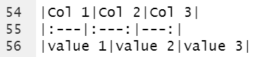

Output:

</font>

|Col 1|Col 2|Col 3|
|:---|:---:|---:|
|value 1|value 2|value 3|

## Visual Editor

<font size="4">

If you are more comfortable using Microsoft Word than R the visual editor in R Studio can be a great resource.  The visual editor provides a word-like interface to edit your markdown document and will add the markdown or html code to your source document.  

To access the visual editor select the compass button in the top right corner of the source panel shown below.

<center>

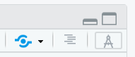{width=150px}

</center>
\

This will render your document and provide a word-like toolbar below the standard R Studio toolbar. 

<center>

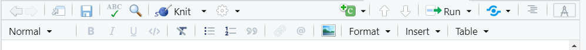{width=600px}

</center>
\

After you are finished in the visual editor, selecting the compass button again will bring you back to your code and any changes you made in the visual editor will be coded for you.

More info on the visual editor can be found [HERE](https://rstudio.github.io/visual-markdown-editing/)
</font>

## Code Chunks

<font size="5">

- All code needs to be in a code chunk to be evaluated.
- Each chunk starts and ends with three `(```)` (the accent mark by your esc key)
- The beginning will also have `{r}` to indicate that it is an r code chunk
- Additional options can be added inside the curly braces to change how the chunk is evaluated or how output is displayed.  A full list of options can be found [HERE](https://yihui.org/knitr/options/)
- Comments can be added to your code chunk with the `#` just like in an R script.
- It is good practice to name your code chunks.  Two philosophies on this are to name each chunk based on what that chunk is doing or what the main output of the chunk is.


</font>


##  Code Chunks Cont....

Each code chunk has a gear icon in the top right corner.  This icon will allow you to name your your code chunk and change how it is evaluated.  

The following output options available in the drop down menu allow you to customize what code is shown in your final report and what code is run in the background but not displayed.  

- Show output only
- Show code and output
- Show nothing (run code)
- Show Nothing (don't run code)


## Code folding

<font size="4">

Updating lines 5-7 of the YAML header as shown below allows for your code to be folded into your document.  This will hide your code initially and add a show code button at the location of each code chunk.  

</font>

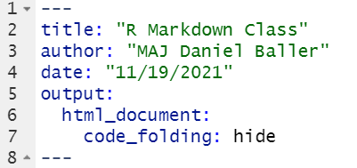

<font size="4">

A code button will also be added at the top right of the knitted document that will that allow you to show or hide all code chunks in the document.

</font>

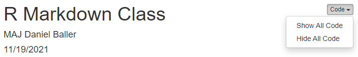

## Klippy

<font size="4">

The klippy package adds a button to each of your code chunks in the knitted document that allows for easy copying of the code.  Klippy can be installed by running: 

```{r eval=FALSE, echo=TRUE}
install.packages("remotes")
remotes::install_github(("rlesur/klippy"))
```

Next, just add the following code chunk anywhere in your document.

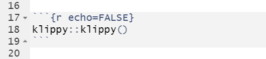{width=450px}
\
You will then see a blue clipboard button in the top left of each code chunk in your knitted document. (Note: klippy only works with Html output)

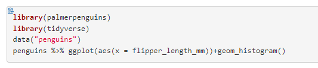{width=450px}
\
More info on the Klippy package can be found [HERE](https://github.com/RLesur/klippy)
</font>

## Pushing files to GitHub (1/6)

<font size="4">

The next few slides will walk you though how to push your files to your github repo.   

Since we created this project as a for version control with GitHub you will notice that you now have a Git Tab in the same panel as your environment.  In this tab you will see all the files that have changed since your last commit.  

</font>

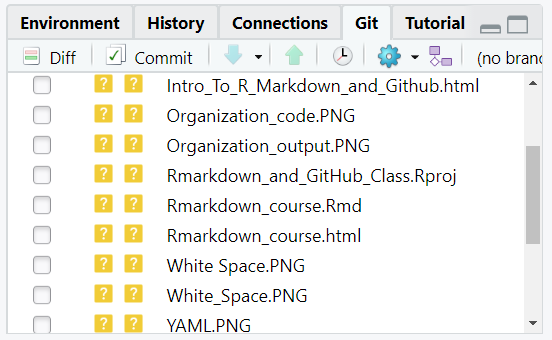

## Pushing files to GitHub Cont...(2/6)

<font size="4">

Before we can push our files to GitHub we need to commit.  Committing creates a permanent snapshot of your changes with an informative description of what you changed that you can then push to GitHub.

- To commit we will first select check box of the file we want to commit.

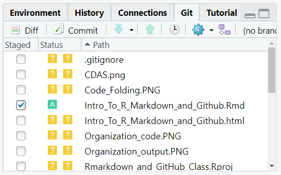

- Next select `Commit` below the history tab.  This will open a new pop-up window. 

</font>

## Pushing files to GitHub Cont...(3/6)

<font size="5">

Next you will add an informative message into the commit message box outlining what you changed in the file.  (Similar to commenting your code, future you and your collaborators will thank you for this.)

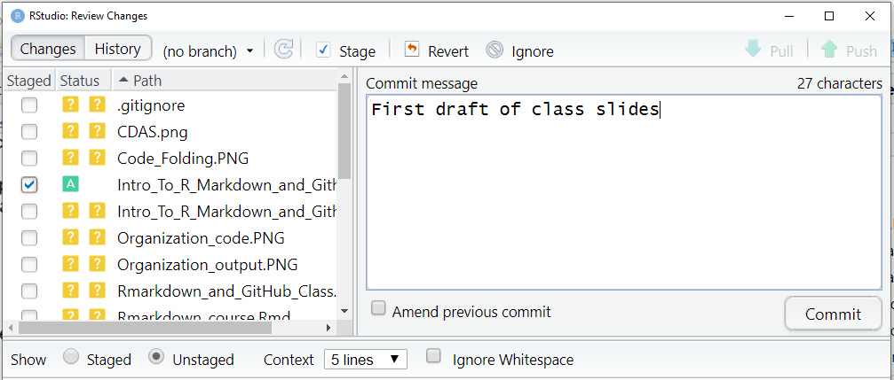{width=750px}

\
After adding your commit message select the `commit` button.

</font>

## Pushing files to GitHub Cont...(4/6)

If everything worked with your commit you should see a new pop up that like the one below.

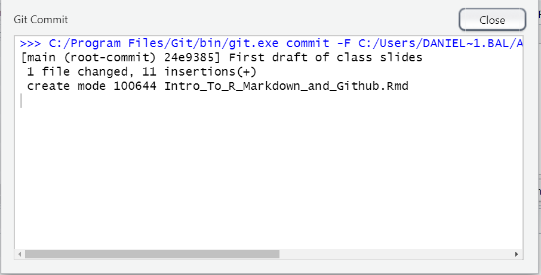{width=750px}

Select `Close` to leave this window.

## Pushing files to GitHub Cont...(5/6)

Now that we have successfully committed, We can push our file to the GitHub Repository by selecting the `Push` button in the top right corner.  

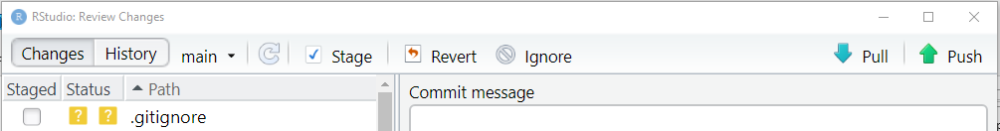{width=750px}

\
If you successfully push your file you should see a new pop up that looks like this.  

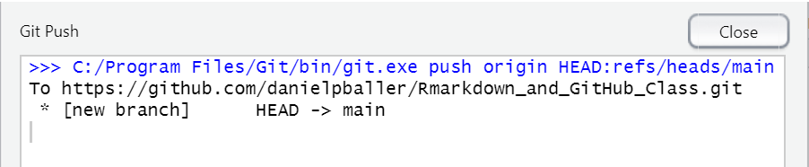{width=750px}

## Pushing files to GitHub Cont...(6/6)

Congratulations you have just committed and pushed your first file.  Now anyone that has access to your repo will have access to this file and any changes you made.

The commit message next to your file name will tell your collaborators what you changed.

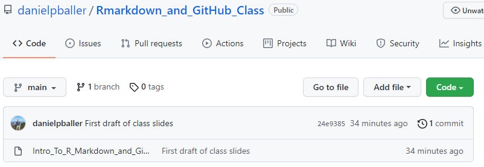{width=750px}

## Pulling files from GitHub

<font size="4">

Pulling files is a much simpler process than pushing.  Pulling updates your local copy of the repo with the remote copy located on GitHub.  This will download any new files or changes to old files that you do not have on your machine.

You can pull by selecting the `blue down arrow` under the connections tab.  

</font>
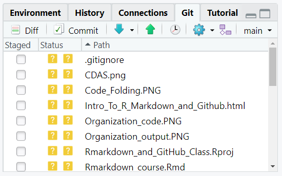{width=600px}

## Pulling files from GitHub

After pulling you will see a message either telling you what files and changes were downloaded or that your local copy of the repo already contained the most recent updates.

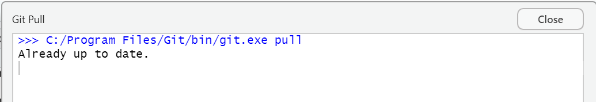{width=750px}

\
You have now successfully pushed to and pulled from GitHub through RStudio.  

## Questions

Any questions or comments on this class please feel free to reach out at:

<center>

 [danielpballer](https://github.com/danielpballer)


[\@danielpballer](https://twitter.com/danielpballer)

 danielballer.usma@gmail.com

</center>


